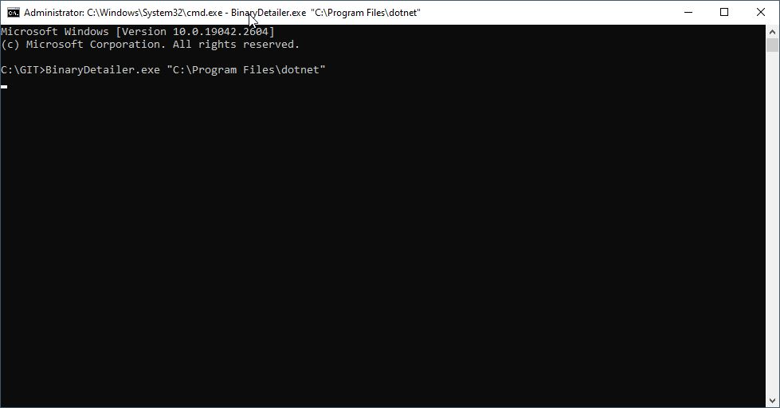
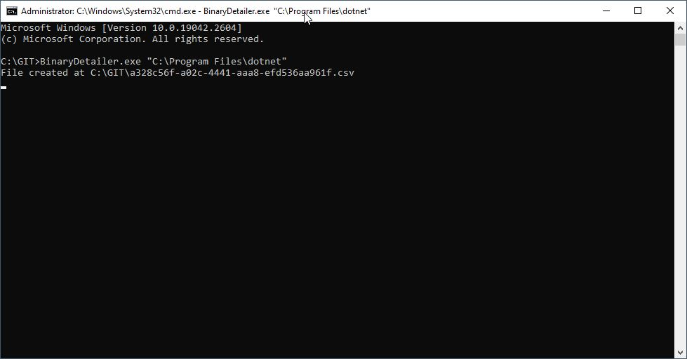
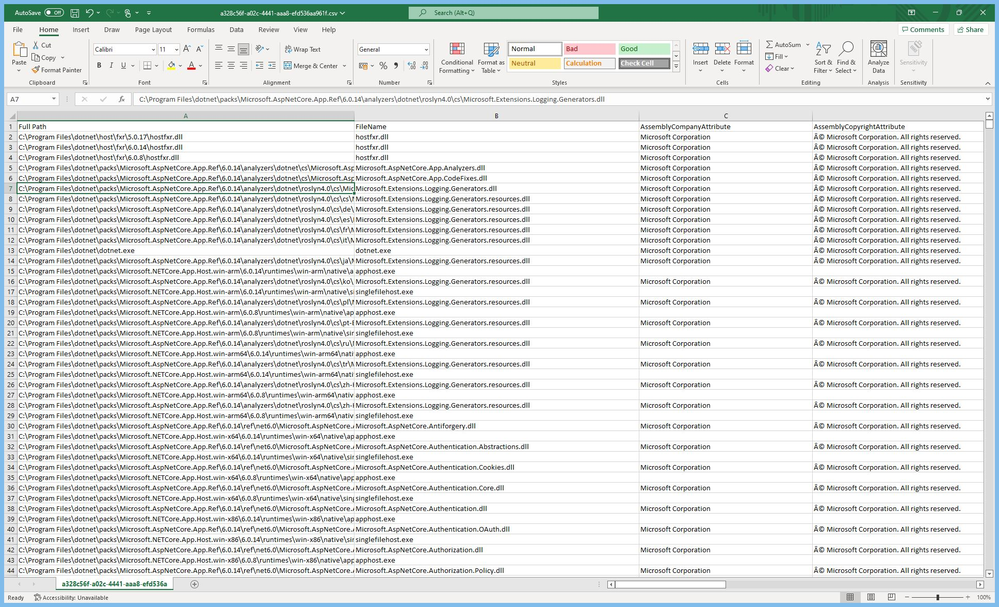

# Binary Detailer
Binary Detailer is a method of outputing binary details such as net framework, 64 bit compatibility, version etc. Given a directory name, it will iterate dll and exe files and output the results to a csv file.
___

### Usage

1. Build the project to produce the BinaryDetailer.exe
2. Open a Windows terminal
3. Call the .exe with file path as an argument
___

### Example

___

## Contribute

Congratulations! You’re up and running. Now you can begin using and contributing your fixes and new features to the project.
